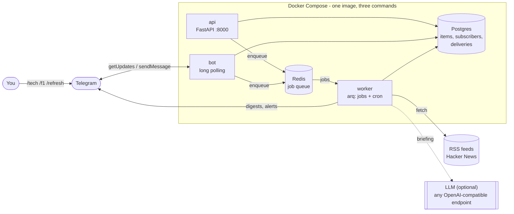

# newshub

A personal automation hub. It collects news on your interests from RSS feeds
and Hacker News, scores each item against your keywords, and delivers the best
of it to you on Telegram: scheduled digests, instant alerts for big stories,
and on-demand digests by command.

Everything it uses is free and open source. There are no paid APIs. AI is
optional: without it, ranking is done by keyword scoring.

## Architecture



| Service | What it does | Command |
|---|---|---|
| `worker` | Cron and job queue. Every 30 minutes it queues one job per source. Each job fetches, scores and stores new items, and pushes alerts. Every minute it checks whether a digest is due. | `arq newshub.worker.WorkerSettings` |
| `bot` | Listens for your Telegram commands by long polling, so no public URL or open port is needed. | `python -m newshub.bot` |
| `api` | Small HTTP API, bound to `127.0.0.1` only. The seed for a web app. | `uvicorn newshub.api:app` |
| `postgres` | Stores items, subscribers and what was sent to whom. No port published. | |
| `redis` | The job queue between services. No port published. | |

### The pipeline

```
cron (every 30 min)
  └─ enqueue_collection            one job per source, per mode
       └─ collect_source           fetch  → adapter in src/newshub/sources/
                                   score  → keywords, source boost, popularity
                                   store  → Postgres, skipping (mode, url) already seen
                                   alert  → new + high score + under 6h old → Telegram now
                                   (fetch failed? retried after 1, 2, 3 minutes)

cron (every minute)
  └─ digest_tick                   is it a mode's digest time in the local timezone?
       └─ send_digest              top unsent items → optional AI briefing → Telegram → mark sent
```

### How scoring works

For every interest keyword in the mode (whole-word, case-insensitive):

- found in the **title**: add `2 × weight`
- otherwise found in the **summary**: add `1 × weight`

Then add the source's `boost`, and a popularity bonus of 0 to 3 for sources
that have one (Hacker News points: 10 → about 1, 100 → about 2, 1000+ → 3).
An item containing any `block` keyword is dropped. The code is about 20 lines:
[src/newshub/scoring.py](src/newshub/scoring.py).

### Where things live

```
config/modes.yaml        your modes: interests, sources, schedule   ← edit this
db/schema.sql            database tables
src/newshub/
  config.py              loads modes.yaml and env vars
  models.py              the Item dataclass everything passes around
  sources/               one file per source type (rss.py, hackernews.py)
  scoring.py             keyword scoring                (pure, no I/O)
  pipeline.py            fetch + score, no database
  digest.py              items → Telegram HTML messages (pure, no I/O)
  delivery.py            read unsent → send → mark sent; alerts
  llm.py                 optional AI briefing
  telegram.py            minimal Telegram Bot API client
  db.py                  all SQL
  jobs.py                the job names services use to talk through Redis
  worker.py  bot.py  api.py  cli.py     the four entry points
tests/                   unit tests, no network
```

Services only share the database tables and the three job names in
[jobs.py](src/newshub/jobs.py). The api and bot never import the worker, so
any one service can be rewritten in another language as long as it keeps that
contract. The feed fetcher is the planned Rust candidate.

## Run it

### 1. Try it with no setup (Python only)

This fetches real feeds, scores them and prints a digest. No Docker, database,
Redis or Telegram involved.

```bash
python -m venv .venv
```
```bash
.venv\Scripts\pip install -e ".[dev]"
```
```bash
.venv\Scripts\python -m newshub.cli preview f1
```

Other useful commands:

```bash
.venv\Scripts\python -m newshub.cli check
```
```bash
.venv\Scripts\python -m pytest
```

`check` fetches every source in `modes.yaml` and reports any that fail.

### 2. Install Docker Desktop (Windows 11, free for personal use)

1. Open PowerShell and run:
   ```bash
   winget install -e --id Docker.DockerDesktop
   ```
   Or download the installer from <https://www.docker.com/products/docker-desktop/>.
2. Keep "Use WSL 2 instead of Hyper-V" ticked in the installer. Windows 11 Home
   requires it.
3. Restart Windows when asked.
4. Start **Docker Desktop** from the Start menu, accept the terms, and skip the
   sign-in (an account is not required). Wait for "Engine running".
5. If it complains about WSL, run `wsl --update` in PowerShell and start it again.
6. Check it works:
   ```bash
   docker run --rm hello-world
   ```

### 3. Create your Telegram bot

1. In Telegram, open a chat with **@BotFather** and send `/newbot`.
2. Pick a name and a username. BotFather replies with a token.
3. Copy `.env.example` to `.env` and paste the token after `TELEGRAM_BOT_TOKEN=`.
   Also change `POSTGRES_PASSWORD`. `.env` is git-ignored; never commit it.

### 4. Start the stack

```bash
docker compose up -d --build
```

Then:

```bash
curl http://127.0.0.1:8000/health
```

should return `{"status":"ok","postgres":"ok","redis":"ok"}`.

Open your bot in Telegram and send `/start`. **The first chat to send `/start`
becomes the owner; every other chat is ignored**, so do this straight away.

Day to day:

| Do this | With |
|---|---|
| See logs | `docker compose logs -f worker bot` |
| Apply a `modes.yaml` change | `docker compose restart worker bot api` |
| Apply a code change | `docker compose up -d --build` |
| Stop | `docker compose down` |
| Stop and delete all data | `docker compose down -v` |

### Telegram commands

| Command | |
|---|---|
| `/start` | Claim the bot (first chat only), show help |
| `/modes` | List modes and their digest times |
| `/tech`, `/gaming`, `/f1` | Digest for that mode now (one command per mode) |
| `/refresh` | Collect from all sources now |
| `/help` | Show commands |

### API

Interactive docs: <http://127.0.0.1:8000/docs>

| | |
|---|---|
| `GET /health` | Checks Postgres and Redis |
| `GET /modes` | Modes and their settings |
| `GET /modes/{mode}/items?limit=20` | Most recently collected items |
| `POST /collect` | Queue a collection of all sources |
| `POST /modes/{mode}/digest` | Queue a digest for a mode |

The API has no authentication. That is acceptable only because it is bound to
`127.0.0.1`. Add auth before exposing it (roadmap step 1).

### Optional: AI briefing

Set `LLM_BASE_URL`, `LLM_API_KEY` and `LLM_MODEL` in `.env` to put a 2-3
sentence summary at the top of each digest. Any OpenAI-compatible endpoint
works: Gemini's or Groq's free tier, or a local Ollama. Examples are in
[.env.example](.env.example). If the call fails, the digest is sent without it.

## Customise

### Add or change a mode

Edit [config/modes.yaml](config/modes.yaml) and add a block under `modes:`.
The key becomes the Telegram command.

```yaml
  cooking:                         # → /cooking
    emoji: "🍳"
    title: Cooking
    digest_times: ["17:00"]        # local time, see `timezone:` at the top
    digest_size: 5
    alert_score: 15                # optional; leave out for no alerts
    interests:
      sourdough: 3
      recipe: 1
    block: [sponsored]
    sources:
      - name: Serious Eats
        url: https://www.seriouseats.com/atom.xml
```

Check it, then restart:

```bash
.venv\Scripts\python -m newshub.cli preview cooking
```
```bash
docker compose restart worker bot api
```

Tuning tips: `preview` prints each item's score in brackets. If alerts are too
frequent, raise `alert_score` above the scores you normally see; if a source is
consistently good, give it a `boost`.

### Add a source to a mode

Add an entry under the mode's `sources:`. For an RSS or Atom feed only `name`
and `url` are needed. Run `python -m newshub.cli check` to confirm it responds.

### Add a new source *type*

Create one file in [src/newshub/sources/](src/newshub/sources/). The file name
is the `type:` you use in `modes.yaml`. It needs one function:

```python
# src/newshub/sources/reddit.py   →   type: reddit
import httpx
from ..config import Source
from ..models import Item

async def fetch(client: httpx.AsyncClient, source: Source) -> list[Item]:
    response = await client.get(f"https://www.reddit.com/r/{source.options['subreddit']}/top.json")
    response.raise_for_status()
    return [
        Item(title=post["data"]["title"], url=post["data"]["url"], source=source.name,
             popularity=post["data"]["score"])
        for post in response.json()["data"]["children"]
    ]
```

Nothing else needs registering. Adapter-specific settings go in `options:`.
Keep the parsing in a separate `parse()` function, as `rss.py` does, so it can
be tested without the network.

### More than one user

v1 serves one person, the owner. The database is already shaped for more: a
`subscribers` table (with an optional list of modes per subscriber) and a
`deliveries` table that records what each subscriber has been sent, so
everyone has their own "unsent" position. What is missing is a way to invite
subscribers and per-subscriber interests; see roadmap steps 4 and 6.

## Known limitations

- The same story from several outlets appears several times; de-duplication is
  by URL only.
- `modes.yaml` is read at start-up, so changes need a restart.
- Schedules are checked once a minute. If the worker is down at a digest time,
  that digest is skipped (the items stay unsent and go out in the next one).
- Old items are never deleted.

## CI

[.github/workflows/ci.yml](.github/workflows/ci.yml) runs on every pull request
and on pushes to `main`: the unit tests on Python 3.12, a Docker image build,
an import check inside the image, and validation of the compose file.

## Roadmap

Not built yet. Each step is chosen to teach a piece of infrastructure.

1. **Deploy** to an Oracle Cloud always-free VM with Terraform, Caddy for TLS,
   DuckDNS for a hostname, and a GitHub Actions deploy.
2. **Kubernetes**: k3s + Helm + Argo CD + Sealed Secrets.
3. **Observability**: Prometheus + Grafana + Loki + OpenTelemetry.
4. **Web app** with a view per mode and settings.
5. **Scale-out**: swap the Redis queue for NATS, KEDA autoscaling, a Rust
   fetcher service.
6. **Reach**: more channels (WhatsApp, email), more source types, multiple
   subscribers with their own interests, embeddings-based personalisation with
   pgvector.
